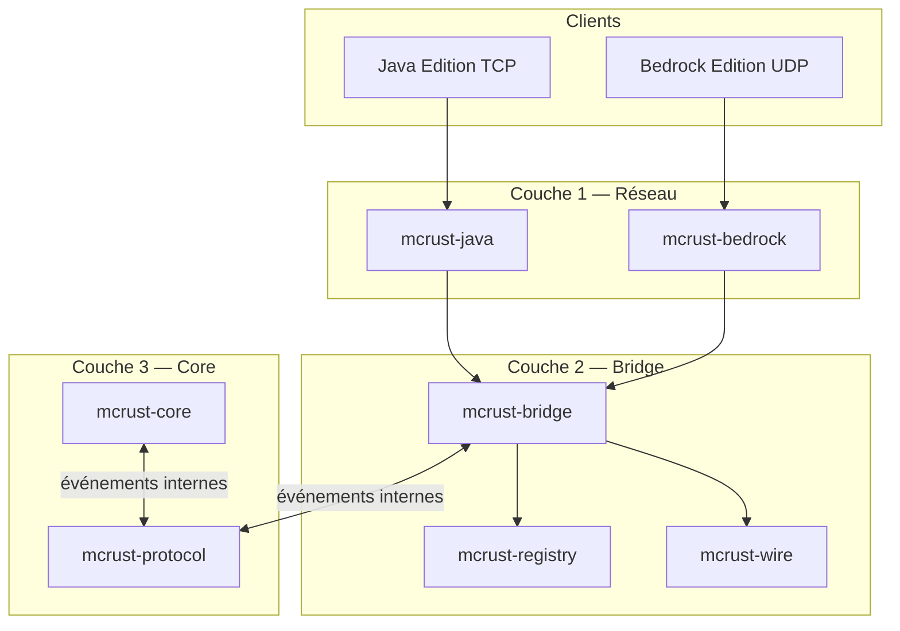
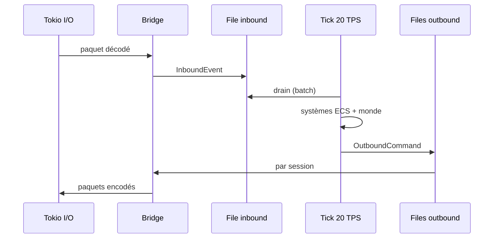

# Architecture mcrust

Ce document décrit l’architecture cible du serveur : découpage en crates, responsabilités, et ordre de construction.

## Vision



| Objectif | Comment |
|----------|---------|
| Performance | Pas de GC ; tick sur thread dédié ; I/O async (tokio) à part |
| Cross-play | Mapping IDs + sémantique unifiée dans `mcrust-registry` |
| Maintenabilité | Dépendances strictes : `core` ne dépend jamais de `java` / `bedrock` |

## Les trois couches

### 1. Entrées / sorties (réseau)

- **Java** : socket TCP, port par défaut `25565`. Voir [network/java.md](network/java.md).
- **Bedrock** : socket UDP, port par défaut `19132`, encapsulation **RakNet**. Voir [network/bedrock.md](network/bedrock.md).

Chaque frontend parse et sérialise **uniquement** son protocole. Il ne modifie pas le monde.

### 2. Middleware (bridge)

`mcrust-bridge` :

- Une **session** par connexion (Java ou Bedrock).
- Conversion **Paquet brut ↔ événement** défini dans `mcrust-protocol`.
- Chiffrement / compression au bon endroit (Java AES, Bedrock selon phase).
- Appels à `mcrust-registry` pour blocs, items, états, entités.

Voir [network/bridge.md](network/bridge.md).

### 3. Cœur (core engine)

`mcrust-core` :

- Boucle **50 ms** (20 TPS).
- **ECS** pour entités et composants.
- Monde (chunks, palette), physique simplifiée, règles de jeu.

Détails : [architecture/core.md](architecture/core.md), [architecture/player.md](architecture/player.md), [architecture/world.md](architecture/world.md), [architecture/tick.md](architecture/tick.md).

## Workspace Cargo (cible)

```
mcrust/
├── crates/
│   ├── mcrust-wire/       # VarInt, buffers, NBT, helpers compression
│   ├── mcrust-registry/   # IDs internes ↔ Java ↔ Bedrock (par version)
│   ├── mcrust-protocol/   # Contrat Bridge ↔ Core (events / commands)
│   ├── mcrust-java/       # TCP + machine d’états Java
│   ├── mcrust-bedrock/    # UDP + RakNet + GamePackets
│   ├── mcrust-bridge/     # Sessions + mapping
│   ├── mcrust-core/       # ECS + monde + tick
│   └── mcrust-server/     # Binaire : config, wiring
```

**Règle :** flèches de dépendance uniquement vers le bas (`server` → tout ; `core` → `protocol`, `registry` ; pas l’inverse).

## Flux de données (runtime)



- **Un seul** thread (ou tâche synchrone) possède l’état mutable du monde à un instant donné : le tick.
- Le réseau ne touche jamais `World` directement.

## `mcrust-protocol` (contrat interne)

Types stables, versionnés si besoin. Exemples (à affiner dans le code) :

**Inbound (réseau → core)**  
`PlayerJoin`, `PlayerLeave`, `PlayerInput`, `ChatMessage`, `ChunkReceived`, `KeepAliveResponse`, …

**Outbound (core → réseau)**  
`SpawnPlayer`, `Despawn`, `Teleport`, `ChunkData`, `BlockChange`, `Disconnect`, `KeepAlive`, …

Le core émet des **intentions** (« ce bloc devient pierre ») ; le bridge les traduit en paquets Java et/ou Bedrock pour les sessions concernées.

## Registre unifié

Chaque bloc, item, entité a un identifiant **interne** (`BlockId`, `ItemId`, …).  
Par version de protocole :

- colonne Java (état + protocol ID),
- colonne Bedrock (name / runtime ID),

chargées depuis `assets/registries/` (JSON Bedrock officiel + tables dérivées Java).

Aucun `0x0B` ou `minecraft:stone` dans le core — seulement `BlockId::STONE`.

## Version Minecraft

Stratégie recommandée : **une paire de versions** par milestone (ex. Java 1.21.x + Bedrock 1.21.x), négociée au handshake. Le serveur refuse proprement les clients trop anciens ou trop récents.

## Roadmap

| Phase | Livrable |
|-------|----------|
| P0 | Repo, docs, CI `cargo test` / clippy |
| P1 | `mcrust-wire` (VarInt, NBT) |
| P2 | Java Status (liste serveur) |
| P3 | Bedrock Unconnected Ping/Pong |
| P4 | `protocol` + `registry` minimal |
| P5 | Login Java offline + play minimal |
| P6 | Session Bedrock + join |
| P7 | Monde plat, mouvement, cross-play |
| P8+ | Blocs, inventaire, auth production |

## Documentation détaillée

- Réseau : [network/README.md](network/README.md)
- Architecture jeu : [architecture/README.md](architecture/README.md)

## Configuration

Paramètres serveur type Paper : fichier **`conf.txt`** — voir [server/conf.txt.md](server/conf.txt.md) et `conf.txt.example`.

Clés auth : `online-mode` (Java), `bedrock-online-mode` (Bedrock).

## Player unifié

Un seul type **`Player`** pour les deux plateformes, avec attribut **`platform: Java | Bedrock`** pour les différences logiques et l’encodage réseau (bridge). Détail : [architecture/player.md](architecture/player.md).

## Authentification officielle

- Java : [network/auth-java.md](network/auth-java.md)
- Bedrock : [network/auth-bedrock.md](network/auth-bedrock.md)

## Handoff initial

La vision produit d’origine (performance, abstraction, bibliographie) reste la référence métier ; ce fichier en est la traduction technique structurée.