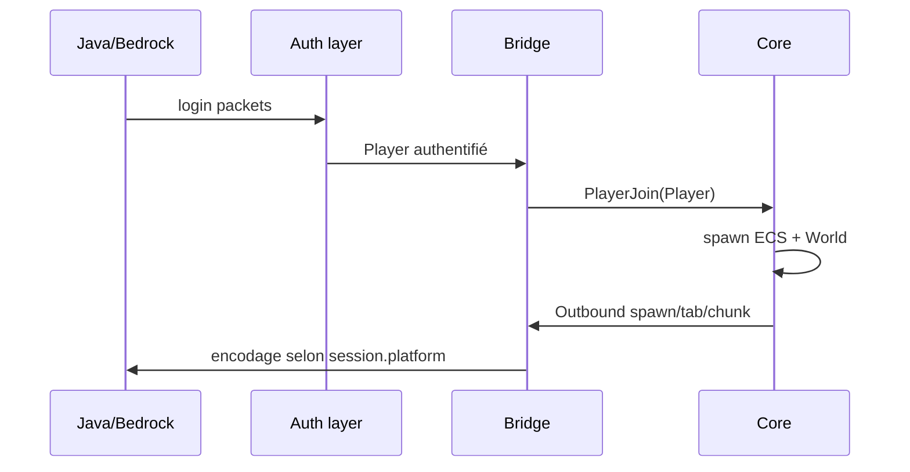

# Player (objet unifié Java + Bedrock)

Il n’existe **qu’un seul** type `Player` dans mcrust (core + bridge). Un joueur connecté en Java et un joueur Bedrock sont la **même abstraction** : même `PlayerId`, même entité ECS, même monde, même chat.

La connexion réseau est modélisée à part (`Session`) ; `Player` représente le **compte / personnage** une fois authentifié.

## Struct cible (conceptuelle)

```rust
// mcrust-core ou mcrust-protocol — noms indicatifs
struct Player {
    id: PlayerId,
    platform: Platform,           // Java | Bedrock — attribut explicite
    name: String,                 // nom vérifié (Mojang ou Xbox)
    uuid: Uuid,                   // identité unifiée (Mojang UUID ou identity Bedrock)
    xuid: Option<String>,         // rempli si platform == Bedrock (online)
    gamemode: Gamemode,
    entity: Option<Entity>,       // lien ECS après spawn
    // permissions, stats — extensions
}

enum Platform {
    Java,
    Bedrock,
}
```

**Règle** : le core manipule `Player` et `Platform` ; il ne distingue pas « JavaPlayer » vs « BedrockPlayer ».

## Pourquoi `platform` ?

Même objet, mais certaines **règles et encodages** dépendent de la plateforme **au niveau logique** (souvent dans le bridge, parfois dans le core) :

| Sujet | Comportement selon `platform` |
|-------|-------------------------------|
| Mouvement / input | Sensibilité, packets source différents ; validation core commune |
| Skin / apparence | Java : propriétés textures Mojang ; Bedrock : client data JWT |
| Tab list / ping | Formats paquets différents |
| Chat | JSON Java vs type Bedrock |
| Forms / UI | Bedrock only → bridge ignore ou noop côté Java |
| Hitbox / eye height | Légers écarts → constantes par `Platform` dans validation |
| Auth déjà faite | Champs `uuid` / `xuid` remplis selon chemin [auth-java](../network/auth-java.md) / [auth-bedrock](../network/auth-bedrock.md) |

Le core peut lire `player.platform` pour des branches **petites et documentées** (ex. portée interaction). Tout ce qui est **encodage réseau** reste dans `mcrust-java` / `mcrust-bedrock`.

## Identifiants

| Type | Portée |
|------|--------|
| `PlayerId` | Serveur, stable pour toute la session de jeu |
| `SessionId` | Une connexion TCP/UDP ; **plusieurs sessions ne partagent pas un Player** en MVP |
| `uuid` | Whitelist, bans, sauvegarde — **une colonne** pour les deux plateformes |
| `xuid` | Bedrock online ; utile logs, modération, liaison compte |

Cross-play : deux amis (un Java, un Bedrock) = **deux `Player`** distincts, chacun avec son `platform`.

## Authentification → `Player`

| Plateforme | Mode | Champs remplis |
|------------|------|----------------|
| Java | `online-mode=true` | `platform=Java`, `uuid`+`name` depuis `hasJoined` |
| Java | `online-mode=false` | `platform=Java`, `uuid` offline dérivé |
| Bedrock | `bedrock-online-mode=true` | `platform=Bedrock`, `xuid`, `uuid` identity, `name` vérifié |
| Bedrock | offline/LAN | `platform=Bedrock`, dev seulement |

Le bridge crée le `Player` **après** auth réussie, puis envoie `InboundEvent::PlayerJoin { player, ... }` au core.

## Cycle de vie



`Session.platform` doit correspondre à `Player.platform` (assert en debug).

## Composants ECS

L’entité porte typiquement :

- `PlayerRef { id: PlayerId }` — pas dupliquer tout le struct dans l’ECS
- `Transform`, `Velocity`, `ChunkObserver`, …

Les données profil (`name`, `uuid`, `platform`) vivent dans une **ressource** `PlayerIndex: HashMap<PlayerId, Player>` ou équivalent.

## Input et gameplay

`InboundEvent::PlayerInput { player_id, ... }` — le core ne reçoit pas de paquets bruts.

Validation mouvement **commune** ; si un jour Bedrock autorise une mécanique absente sur Java (ex. nage spécifique), la règle peut consulter `Player::platform`.

## Déconnexion

Dernière session d’un `Player` fermée → `PlayerLeave` → despawn entité, retrait `PlayerIndex`.

## Ce qui n’est pas dans `Player`

- Clés AES, état RakNet, machine d’états protocole → `Session`
- Runtime IDs blocs → `registry` au bridge

Voir [../network/bridge.md](../network/bridge.md) et [../server/conf.txt.md](../server/conf.txt.md).