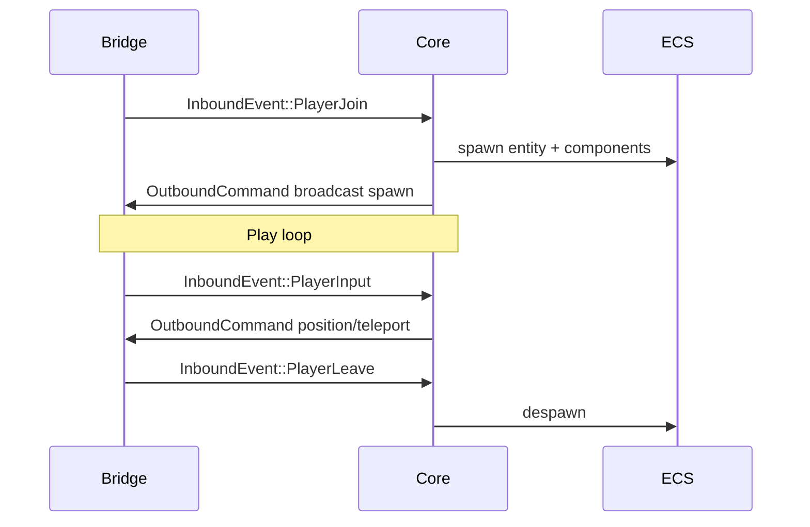

# Joueur

Modèle **interne** du joueur : indépendant des paquets « Player » Java/Bedrock.

## Identités

| Type | Usage |
|------|--------|
| `PlayerId` | Clé serveur stable (u32/u64) |
| `SessionId` | Côté bridge — une connexion réseau |
| UUID Java | Profil, whitelist, offline/online |
| XUID Bedrock | Profil Xbox — phase auth |

Un joueur en jeu est référencé par **`PlayerId`** dans le core.  
Le bridge maintient `SessionId → PlayerId` (1:1 en MVP).

## Profil (`PlayerProfile`)

Données hors ECS ou en ressource globale :

- `display_name`
- `uuid` / `xuid` optionnels
- `platform` d’origine (pour stats, pas pour la physique)
- permissions (op, whitelist) — phase ultérieure

## Cycle de vie

## Input

`PlayerInput` agrège par tick (le bridge peut fusionner plusieurs paquets mouvement entre deux ticks) :

- position cible ou delta (choix : style Java « position » validée serveur)
- yaw / pitch
- flags : sprint, sneak, jump, on ground
- interactions : use, dig (événements séparés)

Le core **valide** : anti-cheat minimal (vitesse max, fly si survival), puis met à jour `Velocity` / téléporte.

## Gamemode

Enum interne : `Survival`, `Creative`, `Adventure`, `Spectator`.  
Mapping depuis paquets login Bedrock/Java au join.

## Visibilité et tab list

- **Tab list** : `OutboundCommand` dédié ou partie du join — encodé différemment Java vs Bedrock.
- **Visibilité entités** : système qui, pour chaque `ChunkObserver`, calcule le set d’entités visibles et émet spawn/despawn/metadata.

Distance de tracking configurable (chunks × 16).

## Chat

`InboundEvent::Chat` → broadcast `OutboundCommand::Chat` avec filtre (commandes, mute).

Format interne : texte + optionnel JSON rich text simplifié ; le bridge formate en JSON Java / type Bedrock.

## Inventaire (phase ultérieure)

Composant `Inventory` + `HeldItem`.  
Synchronisation slot par slot via commands ; mapping items via `mcrust-registry`.

## Cross-play

Java et Bedrock partagent :

- la même position dans le monde (avec adaptation hitbox si nécessaire côté bridge),
- le même `PlayerId` pour les interactions (chat, PvP futur).

Skins et cape : cosmétique réseau — optionnel, pas dans le core.