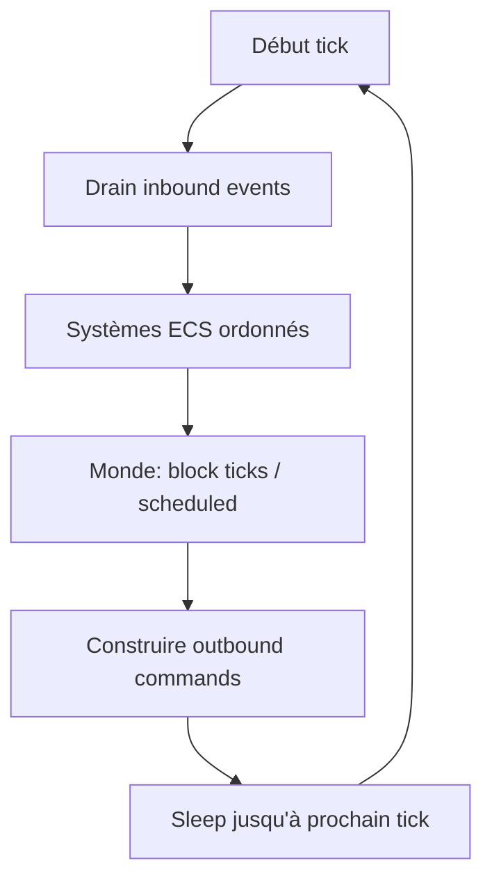

# Boucle de tick (20 TPS)

Objectif : **50 ms** par tick en moyenne, avec correction de dérive.

## Modèle

## Threading

Recommandation :

- **1 thread** (ou tâche dédiée) pour `mcrust-core`.
- Tokio pour I/O uniquement ; communication via `crossbeam-channel` ou `async_channel::Sender` avec `blocking_recv` côté tick.

Ne pas exécuter la simulation dans `tokio::spawn` sans garde-fou — risque de courses sur le monde.

## Ordre des systèmes (exemple)

1. Appliquer joins/leaves (création/destruction entités joueur).
2. Appliquer inputs (vélocité, rotation).
3. Intégration mouvement + collisions.
4. Mise à jour chunks chargés (qui voit quoi).
5. Génération des mises à jour bloc/entité pour les observateurs.

L’ordre est **contractuel** : documenter dans le code quand deux systèmes interagissent.

## Lag et TPS

| Métrique | Signification |
|----------|----------------|
| `tick_duration_ms` | Temps CPU du tick |
| `ticks_behind` | Si > 0, le serveur n’a pas tenu le rythme |

Si un tick dépasse 50 ms :

- Option stricte : pas de rattrapage (1 tick = 1 itération max).
- Option rattrapage : boucle jusqu’à combler (dangereux pour gameplay) — **déconseillé** pour Minecraft-like.

Afficher TPS = moyenne glissante sur les N derniers ticks.

## Keep-alive

Le **core** ou un système dédié émet `OutboundCommand::KeepAlive` avec deadline ; la réponse arrive en `InboundEvent` au tick suivant. Timeout → disconnect via bridge.

## Synchronisation temps jeu

`world_time` (jour/nuit) incrémenté par tick si activé — indépendant du temps mur.

## Tests

- Tick vide < 50 ms sur CI (smoke).
- Scénario : N entités fictives, mouvement constant, pas de régression mesurée.