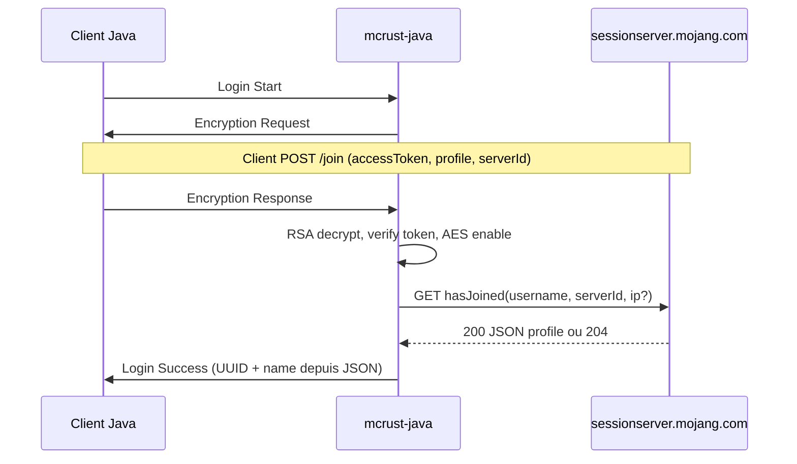

# Authentification Java (officielle / online-mode)

Références : [wiki.vg — Encryption](https://wiki.vg/Protocol_Encryption), [Mojang API — session](https://minecraft.wiki/w/Mojang_API).

mcrust implémente **online-mode** comme un serveur vanilla/Paper : pas de login sans validation Mojang lorsque `online-mode=true` dans `conf.txt`.

## Paramètres `conf.txt`

| Clé | Effet |
|-----|--------|
| `online-mode` | `true` → auth Mojang obligatoire ; `false` → offline (UUID dérivé du nom, pas d’HTTP) |
| `prevent-proxy-connections` | Si `true`, `hasJoined` inclut l’IP client (comportement vanilla) |

## Séquence protocole (login)

1. **Login Start** — le serveur lit le username ; en online-mode il **ignore** l’UUID client pour l’identité finale.
2. **Encryption Request** — clé RSA serveur (DER), verify token aléatoire, `serverId` string (vide en moderne).
3. Le client appelle **`POST https://sessionserver.mojang.com/session/minecraft/join`** avec `accessToken`, `selectedProfile` (UUID sans tirets), `serverId` = hash SHA-1 Minecraft.
4. **Encryption Response** — secret AES 16 octets + token, chiffrés RSA.
5. Serveur : déchiffre, vérifie le token, calcule le même **serverHash**, active **AES/CFB8** (IV = clé = secret).
6. **`GET https://sessionserver.mojang.com/session/minecraft/hasJoined`** — `username`, `serverId`, `ip` optionnel.
7. **200** → `id`, `name`, `properties` (textures signées) ; **204** → kick « failed to verify username ».
8. **Login Success** avec UUID formaté `8-4-4-4-12` et nom **uniquement** depuis la réponse Mojang.

## Hash `serverId` (serverHash)

Entrée SHA-1, dans l’ordre :

1. Chaîne `serverId` de l’Encryption Request, encodage **ISO-8859-1**
2. Secret partagé (16 octets)
3. Clé publique RSA serveur (DER SubjectPublicKeyInfo)

Digest hex **style Minecraft** (entier signé en base 16, préfixe `-` si négatif).

Erreur fréquente : mauvais hash → client `join` OK mais `hasJoined` en 204.

## HTTP Mojang (implémentation `mcrust-java` / `mcrust-bridge`)

| Requête | Détail |
|---------|--------|
| `POST .../session/minecraft/join` | Côté **client** uniquement |
| `GET .../session/minecraft/hasJoined` | Côté **serveur** après decrypt |
| `GET https://api.minecraftservices.com/publickeys` | Cache pour JWT / certificats (Java récent) |

Rate limit typique : ~6 `join` / 30 s / compte.

## Chiffrement flux

- **AES/CFB8/NoPadding**, segment 8 bits
- État du cipher **continu** sur toute la connexion
- Compression zlib **après** chiffrement si activée (ordre protocolaire à respecter par version)

## Vers l’objet `Player` unifié

Après auth réussie, le bridge construit un **`Player`** (voir [../architecture/player.md](../architecture/player.md)) :

- `platform = Java`
- `uuid` = `id` Mojang (officiel)
- `name` = `name` Mojang
- `xuid` = absent
- `skin` / propriétés = depuis `properties` (textures), appliquées côté encodage réseau Bedrock/Java selon la session

## Mode offline (`online-mode=false`)

- Pas d’Encryption Request Mojang (selon version, chiffrement peut quand même exister — suivre la version cible).
- UUID : convention serveur (ex. UUID v3 offline `OfflinePlayer:<name>`).
- **Non** mélanger avec des comptes « officiels » sur le même whitelist sans comprendre la collision de noms.

## Erreurs utilisateur

| Cas | Action |
|-----|--------|
| `hasJoined` 204 | Disconnect login, log warn |
| Multiplayer désactivé (403 join côté client) | Message côté client |
| Token verify mismatch | Fermeture TCP |

## Tests

- Mock HTTP `hasJoined` avec JSON fixe
- Vecteur connu SHA-1 → serverHash (exemples wiki.vg)
- Test intégration : client vanilla online contre serveur de dev