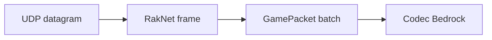

# Protocole Bedrock (UDP / RakNet)

Référence principale : [Mojang/bedrock-protocol-docs](https://github.com/Mojang/bedrock-protocol-docs) (JSON par version).

## Transport

- **UDP** : datagrammes non ordonnés par défaut.
- **RakNet** : couche de fiabilité, ordre, fragmentation, MTU, heartbeat.
- **GamePackets** : payload applicatif Minecraft (souvent batchés, parfois compressés).

`mcrust-bedrock` isole RakNet derrière une API du type « envoyer message fiable ordonné » / « recevoir ».

## Découverte : Unconnected Ping (jalon P3)

Sans connexion établie :

- Client envoie **Unconnected Ping** (magic, time, optional GUID).
- Serveur répond **Unconnected Pong** : timestamp, server GUID, **Server Name** (string sérialisée MOTD + joueurs + version).

Permet l’affichage LAN / outils de liste. Pas encore de joueur en jeu.

## Connexion RakNet (résumé)

1. **Open Connection Request 1 / 2** — négociation MTU.
2. **Connection Request** — accepted.
3. Canaux **reliable ordered** pour la majorité des GamePackets.
4. **Connected Ping/Pong** pour latence et keep-alive transport.

L’implémentation doit gérer : retransmission, ACK/NACK, split packets si > MTU.

## Cycle de vie jeu (haut niveau)

Les noms exacts varient selon la version JSON Mojang ; l’ordre logique reste :

| Étape | Rôle |
|-------|------|
| Login / NetworkSettings | Compression, version, chaînes |
| Resource packs | Stack vanilla : souvent vide ou minimal en custom server |
| Spawn | Position, dimension, gamerules simplifiés |
| Play | Mouvement, chunks, inventaire, entités |

Le bridge mappe chaque GamePacket pertinent vers `InboundEvent` / depuis `OutboundCommand`.

## GamePackets

- Souvent transportés dans un **batch** (plusieurs paquets dans un conteneur).
- IDs et layouts définis dans les `.json` du dépôt Mojang pour la version cible.
- Champs typiques : VarInt, LE strings, vec3f, UUID LE, NBT-like Bedrock.

**Compression** : peut être activée via `NetworkSettings` (algorithm zlib/lz4 selon version).

## Identifiants runtime

Bedrock utilise des **runtime IDs** pour blocs/items qui changent **à chaque version**.  
D’où `mcrust-registry` : clé interne stable → runtime ID pour la version Bedrock choisie.

Ne jamais hardcoder un runtime ID dans le core.

## Auth Bedrock

**`bedrock-online-mode=true`** (défaut `conf.txt`) : vérification officielle JWT / Xbox — détail complet dans [auth-bedrock.md](auth-bedrock.md) (chaîne 3 liens Mojang, token OIDC multiplayer, handshake ECDH).

**`bedrock-online-mode=false`** : développement / LAN uniquement (chaîne self-signed) — **ne pas** exposer sur Internet.

## Différences importantes vs Java

| Sujet | Bedrock | Java |
|-------|---------|------|
| Transport | UDP + RakNet | TCP |
| IDs blocs | Runtime par version | Palette + états |
| UI / forms | Form packets | Chat + inventaire |
| Hitbox / mouvement | Modèle légèrement différent | Référence pour le core au début |

Le core peut commencer sur la sémantique **Java** pour la physique, avec adaptation côté bridge pour les paquets Bedrock (position, rotation).

## Erreurs

- Timeout RakNet → fermeture session.
- GamePacket inconnu : log + ignore si non critique, sinon kick.

## Tests recommandés

- Réponse Unconnected Pong parseable par un client Bedrock réel.
- Unit tests sur decoders générés ou manuels à partir d’un JSON Mojang figé.

## RakNet : build vs buy

Décision projet :

- **Crate externe** : accélère P6, dépendance à auditer.
- **Implémentation interne** : contrôle total, coût élevé.

Le plan mcrust recommande une **façade** `raknet` pour permuter sans toucher au bridge.