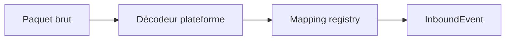

# Bridge (middleware)

`mcrust-bridge` est la **seule** couche qui connaît à la fois les protocoles et `mcrust-protocol`.

## Session vs Player

| Concept | Rôle |
|---------|------|
| **Session** | Connexion réseau (TCP Java ou UDP Bedrock), crypto, état protocole |
| **Player** | Objet jeu unifié — voir [../architecture/player.md](../architecture/player.md) |

Une session authentifiée produit **un** `Player` avec `platform` aligné sur le frontend.

Champs **Session** :

| Champ | Rôle |
|-------|------|
| `session_id` | Identifiant interne unique |
| `platform` | `Java` \| `Bedrock` (copie cohérente avec `Player.platform`) |
| `protocol_version` | Négocié au handshake |
| `player_id` | Après auth, lien vers `Player` |
| `state` | Handshaking, Login, Play, … |
| `crypto` | Clés AES (Java), état ECDH (Bedrock) |

## Auth

- Java online : [auth-java.md](auth-java.md) → puis création `Player { platform: Java, uuid, name, ... }`
- Bedrock online : [auth-bedrock.md](auth-bedrock.md) → `Player { platform: Bedrock, xuid, uuid, name, ... }`
- Options : `online-mode`, `bedrock-online-mode` depuis [conf.txt](../server/conf.txt.md)

## Pipeline entrant

## Pipeline sortant

Le tick produit `OutboundCommand` (souvent ciblés par `PlayerId` ou broadcast).

Le bridge :

1. Résout `PlayerId` → `Session(s)` (MVP : une session par joueur).
2. Pour chaque session, encode selon **`session.platform`** (pas selon un type joueur séparé).
3. Pousse vers les files d’écriture async.

## Join cross-play

1. Joueur A (`Player`, `platform=Java`) et B (`platform=Bedrock`) rejoignent le même monde.
2. Le core tient **deux** entrées `PlayerIndex` — même règles de jeu.
3. Visibilité : un système émet spawn pour chaque observateur ; encodage double côté bridge.
4. Chat : un `OutboundCommand::Chat` avec `PlayerId` → bridge formate Java JSON ou packet Bedrock.

## Files et backpressure

| File | Producteur | Consommateur |
|------|------------|--------------|
| inbound | Bridge | Tick (début de tick) |
| outbound per session | Tick / bridge | Tâche tokio write |

Politique : voir `network-queue-limit` dans `conf.txt`.

## Déconnexion

- Fermeture session → si plus de session pour ce `PlayerId` → `PlayerLeave`.
- Kick → `Disconnect` puis fermeture socket.

## Observabilité

- `tracing` : `session_id`, `player_id`, `platform`, `packet_name`.