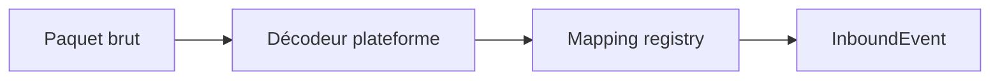

# Bridge (middleware)

`mcrust-bridge` est la **seule** couche qui connaît à la fois les protocoles et `mcrust-protocol`.

## Session

Une session = une connexion client (Java TCP ou Bedrock UDP/RakNet).

Champs conceptuels :

| Champ | Rôle |
|-------|------|
| `session_id` | Identifiant interne unique |
| `platform` | `Java` \| `Bedrock` |
| `protocol_version` | Négocié au handshake |
| `player_uuid` / `xuid` | Selon plateforme |
| `display_name` | Chat, liste tab |
| `entity_id` | Lien vers l’entité ECS après join |
| `state` | Handshaking, Login, Play, … |
| `crypto` | Clés AES (Java), paramètres Bedrock |

Plusieurs sessions peuvent pointer vers **le même** `entity_id` seulement si tu implémentes explicitement le multi-connexion (hors scope initial).

## Pipeline entrant

- Le décodeur est spécifique (`mcrust-java` / `mcrust-bedrock`).
- Le mapping convertit IDs bloc/item/entité → types internes.
- L’événement est poussé dans la **file inbound** (bornée).

## Pipeline sortant

Le tick (ou un système) produit `OutboundCommand` **sans** cible réseau explicite parfois globales (broadcast chunk) :

- **Broadcast** : toutes les sessions en Play dans la même dimension / distance.
- **Unicast** : une `session_id` ou un `player_id`.

Le bridge :

1. Filtre les destinataires (visibilité, distance).
2. Encode **par plateforme** (deux paquets différents pour le même `BlockChange` interne).
3. Pousse vers les files d’écriture async.

## Files et backpressure

| File | Producteur | Consommateur |
|------|------------|--------------|
| inbound | Bridge | Tick (début de tick) |
| outbound per session | Tick / bridge | Tâche tokio write |

Si une file outbound dépasse un seuil :

- Politique configurable : drop mises à jour cosmétiques, throttle, ou kick.

Le tick **ne doit pas** bloquer sur l’écriture réseau.

## Chiffrement et compression

| Plateforme | Où |
|------------|-----|
| Java | AES sur flux après login ; zlib sur paquets |
| Bedrock | Selon NetworkSettings + batch |

Ordre des opérations = celui du protocole (décompresser puis décoder ID, etc.).

## Join cross-play

Scénario cible :

1. Joueur A (Java) et B (Bedrock) rejoignent le même monde.
2. Le core crée **une entité joueur** par compte.
3. Le bridge notifie chaque client des entités visibles avec le bon packet spawn.
4. Chat et mouvements : événements uniques, encodage double.

Les noms d’affichage peuvent différer (Xbox vs Java) ; une table `PlayerProfile` interne unifie.

## Déconnexion

- Client ferme → `InboundEvent::PlayerLeave` ou détection tokio → libération session + despawn côté core si dernier lien.
- Kick serveur → `OutboundCommand::Disconnect` puis flush et fermeture socket.

## Observabilité

- `tracing` spans : `session_id`, `platform`, `packet_name`.
- Métriques : taille files, paquets/s, erreurs decode.