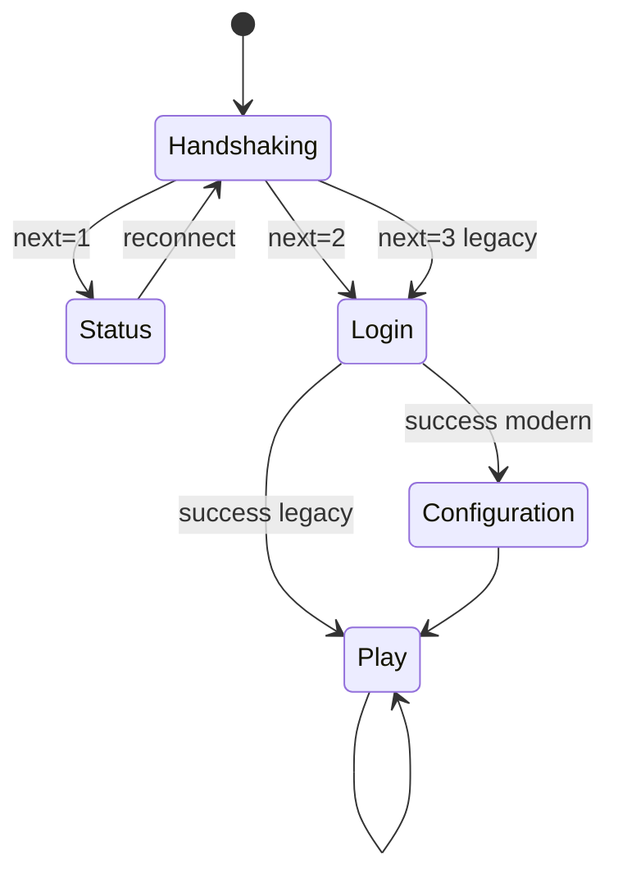

# Protocole Java (TCP)

Référence principale : [wiki.vg — Protocol](https://wiki.vg/Protocol).

## Transport

- **TCP** flux continu : pas de délimitation au niveau OS.
- Chaque **paquet logique** :  
  `packet_length: VarInt`  
  `packet_id: VarInt`  
  `data: bytes[packet_length - taille(id)]`

Le parser maintient un buffer par connexion et consomme des paquets complets avant de traiter l’ID.

## Machine d’états

| État | Usage |
|------|--------|
| Handshaking | Premier paquet : version, adresse, port, `next_state` |
| Status | Liste serveur (ping) — **sans** login |
| Login | UUID, nom, compression, chiffrement |
| Configuration | Registres et feature flags (≥ 1.20.2) |
| Play | Jeu en cours |

`mcrust-java` implémente un **handler par état** : seuls certains `packet_id` sont valides.

## Phase Status (jalon P2)

Séquence typique :

1. Client → `Handshake` (protocol version, host, port, `next_state = 1`).
2. Client → `Status Request`.
3. Serveur → `Status Response` (JSON : `version`, `players`, `description`, `favicon` optionnel).
4. Client → `Ping` (payload long) → Serveur → `Pong`.

Aucune session joueur ; idéal pour valider VarInt + JSON + tokio.

## Phase Login

- `Login Start` (username, UUID optionnel).
- Mode **offline** : UUID dérivé du nom (Mojang v3/v4 selon config).
- Mode **online** : enchaînement encryption request + auth Mojang (HTTP) — plus tard.
- `Set Compression` (seuil) puis paquets compressés zlib si taille ≥ seuil.
- `Login Success` → passage Configuration ou Play.

## Chiffrement (play online)

Après négociation : **AES/CFB8** sur tout le flux TCP post-login.  
Le bridge tient les clés par session ; le decoder/encoder Java applique AES avant VarInt.

## Types binaires fréquents

| Type | Description |
|------|-------------|
| VarInt | LEB128, max 5 octets pour i32 |
| String | VarInt longueur + UTF-8 |
| Position | `(x: i32, z: i32, y: i16)` packé en i64 |
| NBT | Tag compound pour items, entités, chunks (format Java) |
| Slot | Présent + item ID + count + NBT |

Ces primitives vivent dans `mcrust-wire`.

## Play (aperçu)

Une fois en Play, le bridge traduit vers le core :

| Famille paquets | Exemples côté client → serveur |
|-----------------|--------------------------------|
| Mouvement | Position, PositionLook, Look, OnGround |
| Interaction | Use block, Use item, Digging |
| Chat | Chat message, command (selon version) |
| Keep-alive | Réponse au keep-alive serveur |

Côté serveur → client : join game, player position, chunk data, block change, spawn entity, etc.

Chaque paquet a un **protocol version** : `mcrust-java` charge une table `packet_id → codec` par version supportée.

## Configuration (1.20.2+)

État intermédiaire : registres (blocs, items, …) synchronisés avant Play.  
Ne pas l’ignorer pour les clients récents — sinon déconnexion immédiate.

## Erreurs et déconnexion

- Paquet invalide pour l’état → fermeture TCP + log `tracing`.
- `Disconnect` (login/play) avec message chat JSON.

## Tests recommandés

- Golden bytes : VarInt roundtrip, un paquet Status Response connu.
- Intégration : client vanilla ou `bot` minimal qui ne fait que Status.